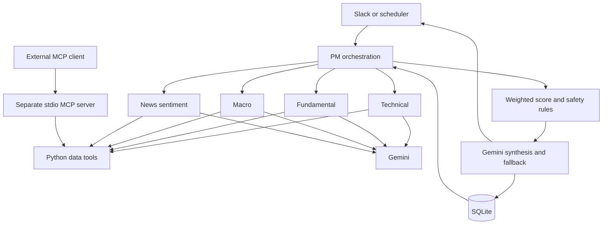

# MCP Stock Agent

**English** | [한국어](README.ko.md)

A Python analysis pipeline combining four specialist reports, deterministic score
aggregation, persistent history and Slack delivery for Korean stock watchlists.

The portfolio value is the integration and failure-handling code. Scores, weights
and generated price targets are not validated investment predictions.

## Problem and solution

A watchlist review involves price indicators, financial metrics, macro conditions
and news. This project collects those inputs separately, runs specialist analyses
concurrently and combines their outputs into a reviewable report.

The PM stage retrieves the previous analysis, computes score changes, applies
Python safety rules, requests a synthesis from Gemini and stores the new result.
Slack supports analysis requests, watchlist changes and history lookup. A weekday
scheduler checks the current watchlist hourly from 09:00 through 15:00 KST.

## Architecture



**The internal agents call Python tool functions directly.** They do not use an
MCP client session and the LLM does not dynamically select tools. The same data
functions are separately exposed as six MCP tools in `mcp_server/server.py`.
This is a fixed async workflow with multiple model calls, rather than autonomous
agent planning or distributed agent execution.

## Engineering decisions

| Decision | Implementation and trade-off |
|---|---|
| Parallel specialist work | `asyncio.gather(..., return_exceptions=True)` preserves sibling results; a failed specialist becomes a neutral score with an error report |
| Deterministic aggregation | Python weights technical/fundamental/macro/sentiment scores by 30/35/20/15%; weights are policy choices without backtesting |
| Explicit missing macro state | Missing currency alerts suppress the buy flag; safety-brake and panic-zone rules cap scores |
| Bounded model retries | Shared async Gemini client makes up to two attempts; this is not a global request budget or circuit breaker |
| Persistent comparison | SQLite stores the watchlist and score history; deltas are computed before saving the current result |
| Separate MCP interface | Typed functions generate tool schemas; import-time output is redirected to stderr to preserve stdout JSON-RPC |
| Single-process operation | Slack Socket Mode and APScheduler share a process; SQLite and a Docker volume avoid a separate database service |

Read [`agents/pm_agent.py`](agents/pm_agent.py),
[`agents/gemini_client.py`](agents/gemini_client.py),
[`db/database.py`](db/database.py) and
[`tests/test_mcp_server.py`](tests/test_mcp_server.py) for the implementation.

## Getting started

Python 3.11+ is required; the Docker image uses Python 3.13.

```sh
git clone https://github.com/YongjunJeong/mcp-stock-agent.git
cd mcp-stock-agent
python3 -m venv .venv
source .venv/bin/activate
python -m pip install -r requirements-dev.txt
python -m pytest -q
ruff check .
```

Tests cover scoring, indicators, failure rules, macro data parsing, SQLite, Slack
parsing and real MCP stdio initialization/tool listing. They do not establish
live market-data availability, model quality or successful Slack delivery.

To run live integrations, copy [`.env.example`](.env.example) to `.env` and supply
Gemini, Slack Bot/App tokens, a Slack channel ID and KRX credentials. Configure a
Slack app for Socket Mode with `app_mentions:read`, `chat:write` and the
`app_mention` event; its App token needs `connections:write`.

```sh
cp .env.example .env
# Edit .env locally. Never commit credentials.
python main.py
```

This starts the scheduler and Slack bot and can send messages and consume API
quota. It is not an offline demo. `WATCHLIST_KR` seeds an empty watchlist; subsequent
changes are read from SQLite. KRX access and public finance-page availability
must be checked in your environment.

For an external MCP client, start only the stdio tool server:

```sh
python -m mcp_server.server
```

Docker deployment configuration is provided:

```sh
docker compose up -d
docker compose logs -f
docker compose down
```

The named volume retains the database. Docker configuration was inspected but
not built or launched during the 2026-10-09 portfolio audit.

## Validation and limitations

In the current 2026-10-09 refinement, **155 tests passed** using the existing local Python 3.11 dependency environment.
The existing GitHub Actions workflow defines lint, tests, MCP registration/import
checks and Docker checks. A workflow definition is not evidence that every remote
run passes.

- Providers and scraped pages can fail or change independently of unit tests.
- Neutral fallback scores permit partial analysis; they are not observations.
  Missing macro alerts block the buy flag, but other missing inputs can still
  contribute a neutral value to an otherwise high aggregate.
- Specialists extract `SCORE` markers from text, rather than validating a typed
  model response. Price targets and strategy text remain generated content.
- Slack commands have no per-user authorization policy or per-user quotas.
- There is no trading execution, portfolio sizing, historical performance
  evaluation, multi-tenant isolation or distributed state management.
- Requirement ranges are not a reproducible lockfile. Live requests send market
  context to Gemini and reports to the configured Slack workspace.

## Next improvements

Add explicit completeness/provenance fields for partial analyses, then test the
resulting decision policy. Introduce a credential-free synthetic end-to-end demo
and measure request latency/cost on that fixed workload. Consider typed outputs,
request budgets and Slack authorization before shared deployment.

## Detailed reference

The [English technical guide](docs/technical-guide.md) preserves configuration,
implementation details, operation and troubleshooting from the original guide.
